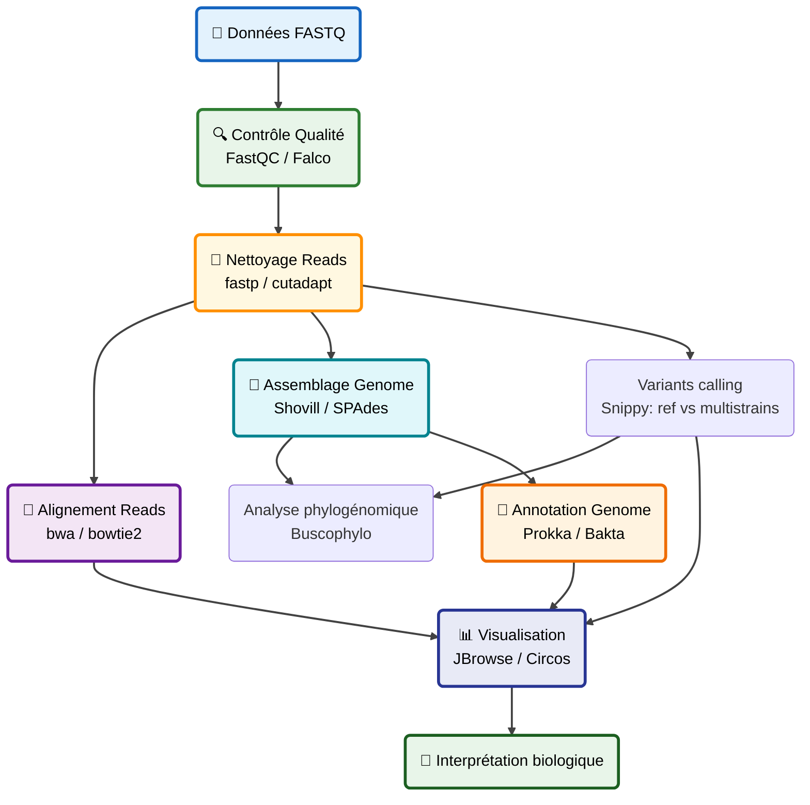
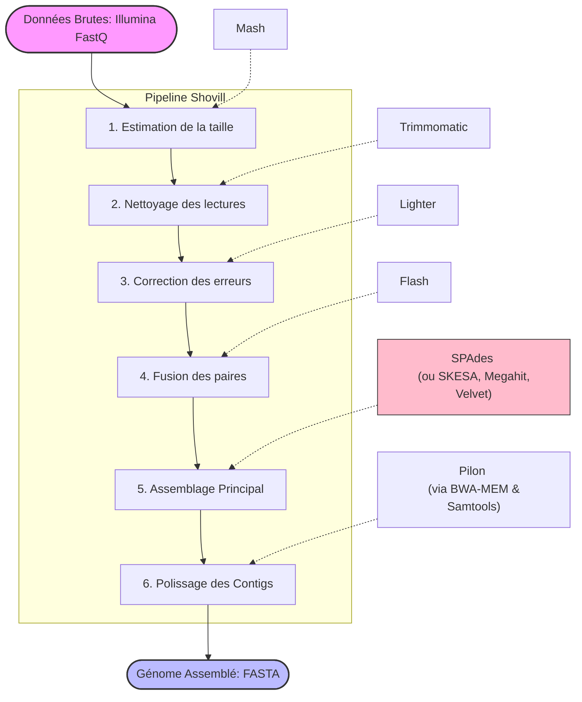

# Workshop Analyses Bioinformatique sous Galaxy 2026 — 

---

# 📚 Sommaire

* [Introduction](#-introduction)
* [Vu d'ensemble des analyses bioinformatiques ](#vu)
* [Contrôle qualité des données NGS](#qc-des-donnees)
* [Cas d'étude 1 — Assemblage d’un génome bactérien MRSA avec des données Illumina MiSeq](#assemblage-genomique1)
* [Cas d'étude 2 — Détection des gènes de résistance aux antibiotiques (AMR) sous Galaxy](#amr)
* [Cas d'étude 3 — Recherche de variants](#snp)
* [Cas d'étude 4 — Visualisation d’un transfert horizontal de gène (HGT)](#hgt)
* [Cas d'étude 5 — Notions de Workflow sous Galaxy](#workflows)
* [Tutoriel sur sars-cov2](#sars-cov2)

---

# 🔬 Introduction

Bienvenue dans cet atelier d’analyse bioinformatique.

Ce support permet aux participants de :

* suivre les étapes d’un workflow bioinformatique ;
* Copier les liens d'acces aux données;
* apprendre progressivement les concepts clés.

Galaxy est une plateforme bioinformatique accessible via navigateur web permettant :

- l’analyse de données NGS ;
- la reproductibilité des workflows ;
- le partage des historiques ;
- l’automatisation des analyses bioinformatiques.

---
<a id="vu"></a>
# 🧪 Vu d'ensemble des analyses bioinformatiques



---


<a id="qc-des-donnees"></a>
# 🧪 Contrôle qualité des données NGS


Lors du séquençage, les bases nucléotidiques d'un échantillon d'ADN ou d'ARN (bibliothèque) sont déterminées par le séquenceur. Pour chaque fragment de la bibliothèque, une séquence est générée, également appelée lecture , qui est simplement une succession de nucléotides.

Les technologies de séquençage modernes permettent de générer un grand nombre de séquences en une seule expérience. Cependant, aucune technologie n'est parfaite et chaque instrument produit des erreurs de nature et de quantité variables, comme l'identification incorrecte de nucléotides. Ces erreurs d'identification sont dues aux limitations techniques propres à chaque plateforme de séquençage.

Il est donc nécessaire de comprendre, d'identifier et d'éliminer les types d'erreurs susceptibles d'affecter l'interprétation des analyses ultérieures. Le contrôle qualité des séquences constitue ainsi une première étape essentielle de votre analyse. Détecter les erreurs au plus tôt permet de gagner du temps par la suite.

## 1. Téléchargé un fichier de séquence brute à partir de la base de données SRA
En bioinformatique, la base de données SRA (Sequence Read Archive) est le plus grand référentiel public mondial de données de séquençage de l'ADN et de l'ARN à haut débit.
Elle fait partie intégrante de l'INSDC (International Nucleotide Sequence Database Collaboration). Les données soumises à l'une des plateformes suivantes sont automatiquement synchronisées entre elles :
NCBI SRA (États-Unis)
ERA / ENA (European Nucleotide Archive, gérée par l'EBI en Europe)
DRA (DDBJ Sequence Read Archive, au Japon)

1. Créez un nouveau historique
2. Renommez le
3. Comment explorer la base de données SRA (Demo NCBI)
4. Importer les données NGS via ````Faster Download and Extract Reads in FASTQ```` en utilisant 'l'accession number' SRRXXX suivant 
````
SRR3111247
````
4. inspecter un des ces fichier
````
@SRR3111247.1/1
GGAATGCCTGATGGCGGTTCGGCACCTGGTTTGCTGAGAGACATCGCTCGCTGCGCATACCATGACGAATAGGGACTGTCGCGGTATGCGTTGCTGCTAA
+
B>:A<9>A@9(BBB95@BD@?C@C????ACCA>>CCDC@>9@A:>>CCFEGHJIHEA>CFC9GGHIJJIGGGD9?GHEIBFIJIIIIHHHDDDFFFFCC@
````
<detailS>
<summary>Qu'est ce que signifie le score de qualité ?</summary>

Le score de qualité de chaque séquence est une chaîne de caractères, un pour chaque base de la séquence nucléotidique, utilisée pour caractériser la probabilité d'une identification erronée de chaque base. Ce score est encodé à l'aide de la table de caractères ASCII (avec quelques différences historiques ).

Pour économiser de l'espace, le séquenceur enregistre un caractère ASCII pour représenter les scores de 0 à 42. Par exemple, 10 correspond à « + » et 40 à « I ». FastQC sait interpréter ces données. On parle alors de score « Phred ».

Encodage du score de qualité en caractères ASCII pour différents encodages Phred. La séquence de code ASCII est affichée en haut, avec les symboles de 33 à 64, les lettres majuscules, d'autres symboles, puis les lettres minuscules. Sanger couvre la plage de 33 à 73, tandis que Solexa est décalé, de 59 à 104. Illumina 1.3 commence à 54 et va jusqu'à 104. Illumina 1.5 est décalé de trois scores vers la droite, mais se termine toujours à 104. Illumina 1.8+ reprend la plage de Sanger, avec un score de plus.

 

Chaque nucléotide est donc associé à un caractère ASCII représentant son score de qualité Phred , c'est-à-dire la probabilité d'une identification de base incorrecte :


| Score de qualité Phred | Probabilité d'appel de base incorrect | Précision de l'appel de base |
| :---: | :--- | :--- |
| 10 | 1 sur 10 | 90% |
| 20 | 1 sur 100 | 99% |
| 30 | 1 sur 1000 | 99,9% |
| 40 | 1 sur 10 000 | 99,99% |
| 50 | 1 sur 100 000 | 99,999% |
| 60 | 1 sur 1 000 000 | 99,9999% |

Que représentent les valeurs de 0 à 42 ?
Ces nombres, intégrés dans une formule, nous indiquent la probabilité d’une erreur pour cette base. Voici la formule, où Q est notre score de qualité (0 à 42) et P la probabilité d’une erreur :
```
Q = -10 log10(P)
```
En utilisant cette formule, nous pouvons calculer qu'un score de qualité de 40 signifie seulement 0,00010 de probabilité d'erreur !

Question: Comment calculer la précision de la base nucléotidique avec le code ASCII ```/```?

Cela peut être calculé comme suit

Le code ASCII /est 47

score de qualité = 47-33=14

Formule pour calculer la probabilité d'erreur :P =10−<sup>Q/10</sup>

Probabilité d'erreur =10− 14 / 10 = 0,03981 = 3,981 %

Par conséquent, la précision est de 100 - 3,981 = 96,019 %.

</details>

### Évaluez la qualité avec FastQC
Une autre méthode pour vérifier la qualité des séquences consiste à utiliser FastQC . Cet outil propose un ensemble d'analyses modulaires permettant de détecter d'éventuels problèmes dans vos données avant toute analyse ultérieure. 

1.Lancer ````FastQC````


2. Quel encodage Phred est utilisé dans le fichier FASTQ pour ces séquences ?
3. commbien des reads nous avons sur ces données?
4. Quelle la taille des reads?
5. Lancer `fastp` sur ce jeux de données en utlisant ces paramètres :
* cut-off de 50 pb en taille.
* Phred score de 20
  


6. comparer le resultat de filtrage avec le resultat précédant de FASTQC.

## 2. Téléchargement des données à partir d'un lien
### Traiement des données en single end


1. importer les données NGS en utilsant ces liens
````
https://zenodo.org/record/3977236/files/female_oral2.fastq-4143.gz
````


2. Lancer `FastQC` et inspecter le resultats
3. Comment vous trouvez ces données en terme de qualité?
4. Utiliser blastn/VecScreen pour voir quels sont les dapatateurs trouvés
5. Utiliser cutadapt pour enlever les adaptateurs et améliorer les sequences brutes ( [adapter list](https://knowledge.illumina.com/library-preparation/general/library-preparation-general-reference_material-list/000001314))
6. Quel pourcentage de lectures contient un adaptateur ?
7. Quel pourcentage de lectures a été tronqué en raison d'une mauvaise qualité ?
8. Quel pourcentage de lectures a été supprimé car trop courtes ?

Nous pouvons examiner nos données tronquées avec  FastQC et faire une comparaison des resultats.
### Traitement des données en paired end
1. Telecharger ces données
````
https://zenodo.org/record/61771/files/GSM461178_untreat_paired_subset_1.fastq
https://zenodo.org/record/61771/files/GSM461178_untreat_paired_subset_2.fastq
````
2.  Lancer FASTQC
3.  Que pensez vous des données?
4.  Lancer cutadapat ou fastp pour améliorer la qualité.
5.  Combien de pb enlevées a cause de la qualité basse?
6.  Combien de séquences courtes supprimées?
---

## 3. Téléchargement des données basé sur des règles
Importation massive des données avec les règles Galaxy (Rule Based Uploader)


Lors des analyses bioinformatiques modernes, il est fréquent de devoir importer :

- des dizaines de fichiers FASTQ ;
- plusieurs échantillons paired-end ;
- des données provenant du SRA ou de l’ENA ;
- des projets multi-échantillons.

Importer manuellement chaque fichier devient rapidement :

- long ;
- fastidieux ;
- source d’erreurs.

Galaxy propose un système puissant appelé :

```text
Rule Based Uploader
```

qui permet :

- d’importer automatiquement des dizaines de fichiers ;
- de construire des collections ;
- d’associer automatiquement les reads paired-end ;
- d’automatiser l’organisation des données.

---

### 🎯 Objectifs

Dans cette partie, nous allons apprendre à :

- utiliser le Rule Based Uploader ;
- importer plusieurs fichiers simultanément ;
- construire automatiquement des collections ;
- créer des paires R1/R2 ;
- préparer des données pour des workflows Galaxy. 

---
On va faire trois importations basées sur des règles :


1. Téléchargement des jeux de données avec des règles
2. Création d'une liste de données simple
3. Création d'une liste de paires de jeux de données

### 📋 1. Téléchargement des jeux de données avec des règles

Nous allons utiliser une sauvegarde de Zenodo. Vous pouvez sélectionner les données ci-dessous et les copier dans votre presse-papiers.
Le Rule Builder utilise généralement un tableau TSV.

Exemple :

```text
study_accession	sample_accession	experiment_accession	fastq_ftp
PRJDA60709	SAMD00016379	DRX000475	https://zenodo.org/records/3263975/files/DRR000770.fastqsanger.gz
PRJDA60709	SAMD00016383	DRX000476	https://zenodo.org/records/3263975/files/DRR000771.fastqsanger.gz
PRJDA60709	SAMD00016380	DRX000477	https://zenodo.org/records/3263975/files/DRR000772.fastqsanger.gz
PRJDA60709	SAMD00016378	DRX000478	https://zenodo.org/records/3263975/files/DRR000773.fastqsanger.gz
PRJDA60709	SAMD00016381	DRX000479	https://zenodo.org/records/3263975/files/DRR000774.fastqsanger.gz
PRJDA60709	SAMD00016382	DRX000480	https://zenodo.org/records/3263975/files/DRR000775.fastqsanger.gz
```

Ces données décrivent :

- l’étude ;
- l’échantillon ;
- l’expérience ;
- le lien FASTQ. 

---

Cliquez sur l'icône de téléchargement en haut à gauche.


Par défaut, la boîte de dialogue de téléchargement simple habituelle s'affiche. Cette boîte de dialogue propose des options plus avancées, accessibles via différents onglets en haut.

Cliquez sur « Basé sur des règles », comme indiqué ci-dessous.


Collez vos données tabulaires directement dans la zone de texte de cette page, comme indiqué ci-dessous.

Cliquez sur le bouton « Créer ».


Plutôt que de modifier les données, nous allons définir des règles pour les manipuler et configurer des « définitions de colonnes » qui indiquent à Galaxy comment utiliser les métadonnées lors du chargement ou de la création d'une collection.

Pour importer ces fichiers dans Galaxy, nous devrons effectuer quelques opérations :

Supprimez cet en-tête des données (il ne contient pas d'URL que Galaxy peut télécharger).

Définissez la colonne `C`comme le `nom` de l'ensemble de données.

Définissez la colonne `D` comme l'`URL` du jeu de données (il s'agit de l'emplacement à partir duquel Galaxy peut télécharger les données).

Indiquez à Galaxy de traiter ces fichiers comme type `fastqsanger.gz`.


### 2. Création d'une liste de données simple

Cet exemple illustrera l'utilisation de tels ensembles de données comme source pour les chargements de collections ; cela peut s'avérer utile lorsque vous souhaitez appliquer les outils de manipulation tabulaire Galaxy existants aux métadonnées avant traitement, par exemple.

Utilisez les meme données précedantes:

```text
study_accession	sample_accession	experiment_accession	fastq_ftp
PRJDA60709	SAMD00016379	DRX000475	https://zenodo.org/records/3263975/files/DRR000770.fastqsanger.gz
PRJDA60709	SAMD00016383	DRX000476	https://zenodo.org/records/3263975/files/DRR000771.fastqsanger.gz
PRJDA60709	SAMD00016380	DRX000477	https://zenodo.org/records/3263975/files/DRR000772.fastqsanger.gz
PRJDA60709	SAMD00016378	DRX000478	https://zenodo.org/records/3263975/files/DRR000773.fastqsanger.gz
PRJDA60709	SAMD00016381	DRX000479	https://zenodo.org/records/3263975/files/DRR000774.fastqsanger.gz
PRJDA60709	SAMD00016382	DRX000480	https://zenodo.org/records/3263975/files/DRR000775.fastqsanger.gz
```

les memes étapes qu'avant, sauf cette fois ci au lieu de définir un `name` pour la colonne `C` on identifie une `list`.

### 3. Création d'une liste de paires de jeux de données

Pour cette partie utilisez cette exemple :
```text
study_accession	sample_accession	experiment_accession	fastq_ftp
PRJDB3920	SAMD00034150	DRX036147	https://zenodo.org/records/3263975/files/DRX036147_1.fastq.gz;https://zenodo.org/records/3263975/files/DRX036147_2.fastq.gz
PRJDB3920	SAMD00034150	DRX036148	https://zenodo.org/records/3263975/files/DRX036148_1.fastq.gz;https://zenodo.org/records/3263975/files/DRX036148_2.fastq.gz
PRJDB3920	SAMD00034150	DRX036149	https://zenodo.org/records/3263975/files/DRX036149_1.fastq.gz;https://zenodo.org/records/3263975/files/DRX036149_2.fastq.gz
PRJDB3920	SAMD00034150	DRX036150	https://zenodo.org/records/3263975/files/DRX036150_1.fastq.gz;https://zenodo.org/records/3263975/files/DRX036150_2.fastq.gz
PRJDB3920	SAMD00034150	DRX036151	https://zenodo.org/records/3263975/files/DRX036151_1.fastq.gz;https://zenodo.org/records/3263975/files/DRX036151_2.fastq.gz
PRJDB3920	SAMD00034153	DRX036152	https://zenodo.org/records/3263975/files/DRX036152_1.fastq.gz;https://zenodo.org/records/3263975/files/DRX036152_2.fastq.gz
PRJDB3920	SAMD00034152	DRX036164	https://zenodo.org/records/3263975/files/DRX036164_1.fastq.gz;https://zenodo.org/records/3263975/files/DRX036164_2.fastq.gz
```

- Filtrez la première colonne par `First or Last N Rows`
- La colonne `D`contient deux liens de téléchargement. Il faut la séparer en deux colonnes par :
```text
From Column, select Using a Regular Expression
“From Column”: D
Select Create columns matching expression groups
“Regular Expression”: (.*);(.*)
“Number of Groups”: 2`Column, select Using a Regular Expression`
```
- A partir de `Rules` on choisit `Remove Column(s)`pour supprimer la colonne `D`
- On a maintenant deux coloonnes avec les urls de téléchargement et on a besoin d'une seule colonne uniquement. Donc, on va `spliter` les colonnes :
```text
From Rules select Split Column(s)
“Odd Row Column(s)”: D
“Even Row Column(s)”: E
Click Apply
```
Ceci produit `ABCD` et `ABCE`
- Maintenant, il faut informer Galaxy lequel des ces fichiers est `R1` et lequel est `R2`:
  
```text
From Column, select Using a Regular Expression
“Column”: D
Select Create columns matching expression groups
“Regular Expression”: .*_(\d).fastq.gz
“Number of groups”: 1
```
- Inverser les colonnes `D`et `E`:
```text
From Rule select Swap Columns
“Swap Column”: D
“With Column”: E
```
- Modifiez la définition des colonnes :
```text
Open the column definitions back up (Rules Menu, Add / Modify Column Definitions)
“paired-end indicator”: column D
“URL”: column E
```
<a id="assemblage-genomique1"></a>
# 🧬 Cas d'étude 1 — Assemblage d’un génome bactérien MRSA avec des données Illumina MiSeq
L'assemblage génomique consiste à reconstruire la séquence complète d'un génome à partir de millions de fragments courts d'ADN (les reads) obtenus par séquençage. C'est un puzzle informatique géant à résoudre sans modèle de départ
Dans cette étape nous allons faire plusier assemblage génomique sur différents jeux de données.

> Source : galaxy training
---


## 1. Objectifs

À la fin de cet atelier, les participants pourront :

- importer des reads Illumina paired-end dans Galaxy ;
- organiser les données en collection paired-end ;
- évaluer la qualité des reads ;
- nettoyer les reads avec `fastp` ;
- assembler un génome bactérien avec `Shovill` ;
- évaluer l’assemblage avec `QUAST`.

---

## 2. Contexte biologique

Cet atelier utilise des données de séquençage Illumina MiSeq provenant d’une souche de **Staphylococcus aureus résistant à la méthicilline** (**MRSA**).

Le MRSA est un pathogène important impliqué dans les infections hospitalières.  
Assembler son génome permet ensuite de réaliser plusieurs analyses :

- recherche de gènes de résistance aux antibiotiques ;
- comparaison entre souches ;
- typage génomique ;
- étude épidémiologique.

---


## 3. Préparation de l’historique Galaxy

Avant de commencer, créer un nouvel historique Galaxy.


1. Ouvrir Galaxy.
2. Créer un nouvel historique.
3. Renommer l’historique, par exemple :

```text
MRSA_Illumina_Assembly
```

<details>
<summary>Pourquoi créer un nouvel historique ?</summary>

Un historique séparé permet d’organiser l’analyse, d’éviter de mélanger les fichiers et de rendre le travail plus reproductible.

</details>

---

## 4. Importation des données

Importer les deux fichiers FASTQ paired-end suivants :

```text
https://zenodo.org/record/10669812/files/DRR187559_1.fastqsanger.bz2
https://zenodo.org/record/10669812/files/DRR187559_2.fastqsanger.bz2
```

### Étapes dans Galaxy

1. Cliquer sur **Upload Data**.
2. Choisir **Paste/Fetch Data**.
3. Coller les deux liens.
4. Cliquer sur **Start**.
5. Fermer la fenêtre.

### Renommer les datasets

Renommer les fichiers en :

```text
DRR187559_1
DRR187559_2
```

### Créer une collection paired-end

1. Sélectionner les deux fichiers.
2. Choisir **Build List of Dataset Pairs**.
3. Vérifier l’appariement `_1` / `_2`.
4. Nommer la collection :

```text
Paired Reads
```

5. Ajouter le tag :

```text
#unfiltered
```

---

### Question — Que contient un fichier FASTQ ?

<details>
<summary>Afficher la réponse</summary>

Un fichier FASTQ contient quatre lignes par read :

1. un identifiant commençant par `@` ;
2. la séquence nucléotidique ;
3. une ligne séparatrice `+` ;
4. les scores de qualité encodés en ASCII.

Exemple :

```text
@read001
ATGCGTACGTAG
+
IIIIHHHHFFFF
```

</details>

---


## 5. Contrôle qualité des reads

Le séquençage peut introduire plusieurs erreurs :

- mauvaise qualité en fin de read ;
- erreurs d’appel de bases ;
- adaptateurs résiduels ;
- reads trop courts ;
- biais de composition GC.

Avant l’assemblage, il est donc nécessaire de contrôler la qualité des données.

### Outil utilisé

Dans le tutoriel original, l’outil utilisé est :

```text
Falco
```

Falco est une alternative rapide à FastQC pour les données courtes de type Illumina.

### Paramètre Galaxy

Outil : **Falco**

```text
Raw read data from your current history: Paired Reads
```

### Résultats à examiner

Dans le rapport HTML, observer :

- Per base sequence quality ;
- Per sequence quality scores ;
- Per base sequence content ;
- GC content ;
- Adapter content.

---

### Interprétation rapide : Per base sequence quality

- Axe X : position de la base dans le read.
- Axe Y : score de qualité Phred.
- Vert : bonne qualité.
- Jaune : qualité moyenne.
- Rouge : mauvaise qualité.

<details>
<summary>Pourquoi la qualité baisse souvent vers la fin des reads Illumina ?</summary>

Au cours du séquençage Illumina, le signal fluorescent devient parfois moins net avec les cycles.  
Cela provoque souvent une baisse progressive de qualité vers la fin des reads.

</details>

---


## 6. Nettoyage avec fastp

Après le contrôle qualité, les reads peuvent être nettoyés avec `fastp`.

### Objectif

Le trimming permet de retirer :

- les bases de mauvaise qualité ;
- les adaptateurs ;
- les reads trop courts.

### Paramètres Galaxy

Outil : **fastp**

```text
Single-end or paired reads: Paired Collection
Select paired collection(s): Paired Reads
```

### Filtrage par longueur

```text
Length required: 30
```

### Coupe selon la qualité

```text
Cut by quality in front (5’): Yes
Cut by quality in tail (3’): Yes
Cutting window size: 4
Cutting mean quality: 20
```

### Rapport

```text
Output JSON report: Yes
```

Après fastp :

- supprimer le tag `#unfiltered` ;
- ajouter le tag `#filtered`.

---

### Question — Quel est l’effet attendu du trimming ?

<details>
<summary>Afficher la réponse</summary>

Le trimming peut :

- réduire légèrement la longueur moyenne des reads ;
- augmenter la proportion de bases Q20 et Q30 ;
- supprimer les adaptateurs ;
- améliorer la qualité globale des données.

Le contenu GC ne doit normalement pas changer fortement.

</details>

---

## 7. Assemblage avec Shovill

Une fois les reads nettoyés, on peut assembler le génome.

### Pourquoi Shovill ?

`Shovill` est un pipeline bio-informatique open-source conçu pour assembler des génomes bactériens (ou d'autres petits microbes) à partir de séquençage Illumina. Il agit comme un "emballage" (wrapper) pour des assembleurs comme SPAdes, permettant de les rendre beaucoup plus rapides et efficaces



### Paramètres Galaxy

Outil : **Shovill**

```text
Input reads type: Paired Collection
Paired collection: sortie paired-end de fastp
Estimated genome size: 2914567
```

### Sorties principales

Shovill produit :

1. un fichier log ;
2. un fichier FASTA contenant les contigs ;
3. un graphe d’assemblage.

---

### Question — Qu’est-ce qu’un contig ?

<details>
<summary>Afficher la réponse</summary>

Un contig est une séquence continue reconstruite à partir de reads qui se chevauchent.

Avec des reads courts Illumina, un génome bactérien est souvent assemblé en plusieurs contigs.

</details>

---


## 8. Évaluation avec QUAST

`QUAST` permet d’évaluer la qualité d’un assemblage génomique.

### Paramètres Galaxy

Outil : **QUAST**

```text
Assembly mode: Co-assembly
Contigs/scaffolds file: sortie Contigs de Shovill
```

### Métriques importantes

Observer dans le rapport QUAST :

- nombre de contigs ;
- longueur totale de l’assemblage ;
- N50 ;
- taille du plus grand contig ;
- contenu GC.

---

### Question — Comment interpréter un rapport QUAST ?

<details>
<summary>Afficher la réponse</summary>

Un bon assemblage bactérien devrait avoir :

- une longueur totale proche de la taille attendue du génome ;
- un nombre limité de contigs ;
- un N50 élevé ;
- un contenu GC cohérent avec l’espèce.

Cependant, avec des reads courts, il est fréquent de ne pas obtenir un génome fermé en un seul contig.

</details>

## 🧬 9. Annotation génomique avec Prokka


L'annotation génomique est le processus qui consiste à identifier les éléments fonctionnels d'une séquence d'ADN après son assemblage.

Si l’assemblage permet d’obtenir les **“pages du livre”** du génome, alors l’annotation permet :

- d’identifier les gènes ;
- de prédire leurs fonctions ;
- de localiser les ARNr et ARNt ;
- de comprendre l’organisation biologique du génome.

---

### 🚀 Qu’est-ce que Prokka ?

`Prokka` est un logiciel standard de bioinformatique utilisé pour :

- l’annotation rapide ;
- l’annotation automatisée ;
- des génomes bactériens et archéens.

Développé par **Torsten Seemann**, Prokka est très populaire car il permet d’annoter un génome bactérien complet en quelques minutes.

---

### 🛠️ Outil Galaxy

```text
Prokka
```

---

### 📥 Entrée

```text
Contigs assemblés (.fasta)
```

---

### 📤 Résultats générés par Prokka

Prokka produit plusieurs fichiers importants.

---

### 📂 1. Fichiers de séquences (FASTA)

#### `.faa` — Fasta Amino Acid

Contient les séquences protéiques des CDS prédits.

#### Utilisations

- analyses de pangenome ;
- alignements protéiques ;
- annotation fonctionnelle ;
- phylogénie.

#### Outils compatibles

- Roary
- Panaroo
- BLASTp

---

#### `.ffn` — Fasta Functional Nucleotide

Contient les séquences nucléotidiques des régions annotées :

- CDS ;
- ARNr ;
- ARNt.

---

#### `.fna` — Fasta Nucleic Acid

Copie du génome d’entrée renommée avec le préfixe Prokka.

---

### 📂 2. Fichiers d’annotation complète

#### `.gff` — General Feature Format v3

⚠️ Fichier le plus important.

Il contient :

- coordonnées génomiques ;
- type des gènes ;
- fonctions annotées ;
- informations biologiques.

#### Utilisations

- visualisation génomique ;
- analyses comparatives ;
- annotation fonctionnelle.

#### Outils compatibles

- JBrowse
- IGV
- Artemis

---

#### `.gbk` — GenBank

Contient :

- la séquence ADN ;
- toutes les annotations.

Format standard compatible avec :

- NCBI ;
- Artemis ;
- Mauve.

---

### 📂 3. Rapports et statistiques

#### `.txt` — Résumé texte

Rapport synthétique contenant :

- nombre total de bases ;
- nombre de CDS ;
- nombre d’ARNt ;
- nombre d’ARNr ;
- protéines hypothétiques.

---

#### `.log` — Journal d’exécution

Historique technique du pipeline Prokka.

Permet de vérifier :

- les erreurs ;
- les outils exécutés ;
- les problèmes éventuels.

---

### 📂 4. Fichiers pour soumission NCBI

#### `.tbl` — Feature Table

Tableau contenant :

- coordonnées des gènes ;
- produits annotés.

Utilisé pour les soumissions NCBI.

---

#### `.sqn` — Sequin file

Format ASN.1 compatible avec :

```text
NCBI Sequin
```

Permet la soumission de génomes annotés.

---

#### `.err` — Error report

Contient les erreurs pouvant bloquer une soumission :

- codons invalides ;
- problèmes d’annotation ;
- gènes incomplets.

---

### ❓ Questions interactives

### Pourquoi le fichier `.gff` est-il important ?

<details>
<summary>👁️ Afficher la réponse</summary>

Le fichier GFF contient :

- les coordonnées exactes des gènes ;
- les annotations fonctionnelles ;
- les types de features biologiques.

Il est indispensable pour :

- JBrowse ;
- IGV ;
- analyses comparatives ;
- visualisation génomique.

</details>

---

### Quelle différence entre `.faa` et `.ffn` ?

<details>
<summary>👁️ Afficher la réponse</summary>

- `.faa` → séquences protéiques ;
- `.ffn` → séquences nucléotidiques des gènes.

</details>

---

### Pourquoi certaines protéines sont annotées “hypothetical protein” ?

<details>
<summary>👁️ Afficher la réponse</summary>

Ces protéines sont prédites mais :

- aucune fonction connue n’a été trouvée ;
- aucun homologue fiable n’existe dans les bases de données.

</details>

---

### ✅ À retenir

- Prokka est un outil rapide d’annotation bactérienne.
- Le fichier `.gff` est central pour les analyses downstream.
- `.faa` contient les protéines.
- `.ffn` contient les séquences nucléotidiques annotées.
- `.gbk` est le format standard GenBank.
- Les fichiers `.tbl` et `.sqn` servent aux soumissions NCBI.
   

## 🧬  Recrutement des lectures 

Pour vérifier l'assemblage, nous devons `re-mapper` les reads sur les contigs assemblés et verifier le poucentage des lectures alignées.
Utilisez `bowtie2` pour remapper les reads sur les contigs

---
## 10. Visualisation de l'assemblage sous JBrowse
### Paramètres Galaxy


Outil : **JBrowse**

```text
Reference genome to display: Use a genome frome history
Contigs/scaffolds file: sortie Contigs de Shovill
Clicke on Insert Track Group + Insert Annotation Track : GFF/GFF3/BED Features
```


## 11. Visualisation de l'assemblage avec Circos

Outil : **Circos**
Pour publier l'asemblage d'un génome dans le cadre d'un projet, nous avons besoin d'une figure plus élégante avec une identification claire de la sequence. Circos est un outil ideale pour générer des représentations graphiques circulaires de données génomiques. Cet outil permet de cartographier l'architecture du chromosome en affichant simultanément, sous forme d'anneaux concentriques colorés, l'emplacement exact et la densité des gènes sur les brins direct et inverse, facilitant ainsi la visualisation globale et l'analyse comparative des structures de notre assemblage.

Voici les étapes méthodologiques pour réaliser cette figure sous Galaxy :

#### Étape 1 : Filtrage et séparation des gènes par brin (GFF)
Avant d'utiliser Circos, le fichier d'annotation GFF doit être séparé en deux sous-ensembles distincts selon l'orientation des gènes.
* Utiliser l'outil **Filter data on any column using simple expressions**.
* **Brin direct (+)** : Appliquer l'expression `c3=='gene' and c7=='+'` pour isoler les gènes *forward*.
* **Brin inverse (-)** : Appliquer l'expression `c3=='gene' and c7=='-'` pour isoler les gènes *reverse*.

#### Étape 2 : Extraction des coordonnées pour Circos
Circos nécessite un format simplifié à 3 colonnes (`Chromosome`, `Début`, `Fin`) pour positionner les éléments sur le cercle.
* Utiliser l'outil **Cut columns from a table**.
* Extraire les colonnes avec la configuration `c1,c4,c5`.
* Répéter l'opération pour le fichier du brin direct et celui du brin inverse.

#### Étape 3 : Configuration du squelette circulaire (Karyotype)
Cette étape définit la structure externe et la forme parfaitement circulaire du génome bactérien.
* Ouvrir l'outil **Circos visualizes data**.
* Dans l'onglet **Karyotype**, sélectionner le fichier FASTA du génome comme source de référence.
* Dans la section **Ideogram**, régler le paramètre **Spacing Between Ideograms** sur **`0`** (zéro degré) pour fusionner les extrémités et obtenir un cercle fermé sans discontinuité.

#### Étape 4 : Superposition des pistes de gènes (2D Data Tracks)
Les fichiers de coordonnées extraits à l'étape 2 sont intégrés sous forme de deux anneaux concentriques indépendants.
* **Piste 1 (Brin direct)** : 
  * Insérer une piste de type **Tile**.
  * Définir un rayon extérieur (**Outside Radius**) à `0.95` et intérieur à `0.88`.
  * Assigner une couleur spécifique (ex: `blue`).
* **Piste 2 (Brin inverse)** : 
  * Insérer une seconde piste de type **Tile**.
  * Définir un rayon extérieur à `0.86` et intérieur à `0.79` pour éviter tout chevauchement vertical.
  * Assigner une couleur contrastante (ex: `red`).

#### Étape 5 : Génération de la figure
* Cliquer sur **Run Tool** pour lancer le pipeline graphique.
* Récupérer la cartographie haute résolution exportée automatiquement aux formats vectoriel (**SVG**) et image (**PNG**) pour la publication.


### Points clés

- Le contrôle qualité est indispensable avant l’assemblage.
- `fastp` améliore la qualité des reads.
- `Shovill` est adapté aux petits génomes bactériens.
- Les reads courts peuvent donner un assemblage fragmenté.
- `QUAST` permet d’évaluer quantitativement l’assemblage.

---

<a id="amr"></a>
# 🦠 Cas d'étude 2 — Détection des gènes de résistance aux antibiotiques (AMR) sous Galaxy

> Adapté du tutoriel Galaxy Training Network :
>
> « Identification of AMR genes in an assembled bacterial genome »
>
> Source : [https://training.galaxyproject.org/training-material/topics/genome-annotation/tutorials/amr-gene-detection/tutorial.html#visualisation-of-the-args](https://training.galaxyproject.org/training-material/topics/genome-annotation/tutorials/amr-gene-detection/tutorial.html#visualisation-of-the-args)

---


## 🔬 Introduction

La résistance aux antibiotiques (AMR : Antimicrobial Resistance) représente un problème majeur de santé publique.

Le séquençage génomique permet aujourd’hui de détecter les gènes de résistance présents dans les génomes bactériens.

Dans ce tutoriel Galaxy, nous allons :

* détecter les gènes AMR ;
* identifier les gènes plasmidiques ;
* visualiser les gènes dans leur contexte génomique ;
* explorer les résultats biologiquement.

---


## 🦠 Contexte biologique

Le jeu de données correspond à une souche de :

```text
Methicillin-Resistant Staphylococcus aureus (MRSA)
```

Le MRSA est un pathogène hospitalier important.

Les objectifs biologiques sont :

* identifier les gènes de résistance ;
* comprendre leur localisation ;
* visualiser les gènes sur les contigs ;
* identifier les plasmides potentiels.

---


## 🧪 Workflow global

```text
Contigs assemblés
        ↓
staramr
        ↓
Extraction des ARGs
        ↓
Conversion en GFF3
        ↓
Annotation avec Bakta
        ↓
Visualisation avec JBrowse
        ↓
Interprétation biologique
```

---


### 🚀 Préparation de Galaxy

#### Étapes

1. Ouvrir Galaxy.
2. Créer un nouvel historique.
3. Renommer l’historique.

Exemple :

```text
AMR_MRSA_Galaxy
```

---

#### 📥 Importation des données

Importer les contigs assemblés dans Galaxy.

Les données correspondent à un génome bactérien déjà assemblé.

---

### ❓ Pourquoi utiliser des contigs assemblés ?

<details>
<summary>👁️ Afficher la réponse</summary>

Les outils de détection AMR fonctionnent généralement mieux sur des génomes assemblés.

Les contigs permettent :

* d’obtenir des gènes complets ;
* d’analyser le contexte génomique ;
* d’identifier des plasmides ;
* de visualiser les gènes dans JBrowse.

</details>

---


## 🧬 Détection des gènes AMR avec staramr

### 🎯 Objectif

Identifier :

* les gènes de résistance aux antibiotiques ;
* les gènes plasmidiques.

---

### 🛠️ Outil Galaxy

```text
staramr
```

StarAMR est un outil bio-informatique open source (accessible sur GitHub) développé par le Laboratoire national de microbiologie du Canada (ASPC). Il sert à scanner des génomes bactériens pour détecter la présence de gènes liés à la résistance aux antimicrobiens (RAM).

*Comment ça fonctionne ?*

StarAMR compare les séquences d'ADN assemblées d'une bactérie (les contigs) avec des bases de données de référence :
ResFinder : Identifie les gènes qui rendent la bactérie résistante aux antibiotiques.
PointFinder : Détecte les mutations ponctuelles dans l'ADN qui confèrent une résistance.
PlasmidFinder : Repère les plasmides (fragments d'ADN) souvent responsables de la propagation de ces gènes de résistance d'une bactérie à une autre.
*À quoi ça sert ?*
Il permet de faire de la prédiction génotypique, c'est-à-dire de prévoir à quels antibiotiques la bactérie sera résistante uniquement en lisant son génome, sans avoir à réaliser de tests de culture en laboratoire (phénotypage).
Il génère des rapports détaillés (tableaux) listant les gènes, les mutations et les antibiotiques concernés.


---

### ⚙️ Paramètres

Entrée :

```text
Contigs assemblés
```

Lancer l’analyse avec les paramètres par défaut.

---

### 📄 Fichiers générés

Les fichiers importants sont :

| Fichier              | Description         |
| -------------------- | ------------------- |
| summary.tsv          | résumé des ARGs     |
| detailed_summary.tsv | détails des gènes   |
| resfinder.tsv        | résultats ResFinder |
| plasmidfinder.tsv    | plasmides détectés  |

---

### ❓ Questions

1. Combien de gènes AMR ont été détectés ?
2. Quel gène est associé à la résistance à la méthicilline ?
3. Des plasmides ont-ils été détectés ?

---

### ❓ Quel gène est attendu chez MRSA ?

<details>
<summary>👁️ Afficher la réponse</summary>

Le gène attendu est :

```text
mecA
```

Ce gène code une protéine PBP2a impliquée dans la résistance à la méthicilline.

</details>

---


### 📊 Exploration des résultats

Le fichier :

```text
detailed_summary.tsv
```

contient :

* Isolate ID : L'identifiant du ou des fichiers d'isolats/génomes transmis à staramr.
* Data : Le gène particulier détecté à partir de ResFinder, PlasmidFinder, PointFinder, ou le type de séquence.
* Data Type : Le type de gène (Résistance ou Plasmide), ou MLST.
* Predicted Phenotype : Le phénotype RAM (résistance aux antimicrobiens) prédit trouvé dans ResFinder/PointFinder. Les plasmides seront laissés vides par défaut.
* CGE Predicted Phenotype : Le phénotype RAM prédit par le CGE trouvé dans ResFinder/PointFinder. Les plasmides seront laissés vides par défaut.
* %Identity : Le pourcentage d'identité du meilleur HSP BLAST avec le gène.
* %Overlap : Le pourcentage de chevauchement du meilleur HSP BLAST avec le gène (calculé comme : longueur du hsp / longueur totale * 100).
* HSP Length/Total Length : La longueur du meilleur HSP BLAST par rapport à la longueur totale du gène (nucléotides).
* Contig : L'identifiant du contig contenant ce gène.
* Start : Le début du gène (sera supérieur à "End" si sur le brin moins).
* End : La fin du gène.
* Accession : Le numéro d'accession du gène provenant de la base de données ResFinder ou PlasmidFinder.

`plasmidfinder.tsv `: Un fichier tabulaire contenant chaque type de plasmide RAM (résistance aux antimicrobiens) et des informations BLAST supplémentaires issues de la base de données PlasmidFinder, à raison d'un type de plasmide par ligne avec les colonnes suivantes :
* Isolate ID : L'identifiant du ou des fichiers d'isolats/génomes transmis à staramr.
* Plasmid : Le type de plasmide particulier détecté.
* %Identity : Le pourcentage d'identité du meilleur HSP BLAST avec le type de plasmide.
* %Overlap : Le pourcentage de chevauchement du meilleur HSP BLAST avec le type de plasmide (calculé comme : longueur du hsp / longueur totale * 100).
* HSP Length/Total Length : La longueur du meilleur HSP BLAST par rapport à la longueur totale du type de plasmide (nucléotides).
* Contig : L'identifiant du contig contenant ce type de plasmide.
* Start : Le début du type de plasmide (sera supérieur à "End" si sur le brin moins).
* End : La fin du type de plasmide.
* Accession : Le numéro d'accession du type de plasmide dans la base de données PlasmidFinder.

---

### ❓ Quels sont les différents types de séquences identifiés ?

<details>
<summary>👁️ Afficher la réponse</summary>

L'inspection des résultats de staramr révèle la présence de :

* **1 MLST** ;
* **5 gènes rep** (gènes plasmidiques) ;
* **7 gènes de résistance**.

</details>

### ❓ Où sont situés les gènes plasmidiques ?

<details>
<summary>👁️ Afficher la réponse</summary>

Les gènes plasmidiques sont localisés sur les contigs suivants :

* **contig00019** (contient 3 gènes — cohérent avec Lozano et al. 2012) ;
* **contig00024** ;
* **contig00002**.

</details>

### ❓ Où sont situés les gènes de résistance ?

<details>
<summary>👁️ Afficher la réponse</summary>

La répartition des gènes de résistance se décline ainsi :

* **4/7** sont situés sur des contigs contenant des gènes plasmidiques (`contig00002`, `contig00019`, `contig00024`) ;
* **3/7** sont situés sur des contigs sans gènes plasmidiques (`contig00022`, `contig00021`).

</details>

### ❓ En recherchant le numéro d'accession (M13771) sur NCBI, d'où provient la première résistance ?

<details>
<summary>👁️ Afficher la réponse</summary>

La recherche du numéro d'accession **M13771** sur NCBI montre que :

* Il s'agit de la **6’-aminoglycoside acétyltransférase phosphotransférase (AAC(6’)-APH(2’))**, une protéine de résistance bifonctionnelle issue de ***Streptococcus faecalis*** ;
* Cette résistance provient probablement d'un **transfert horizontal** depuis *Streptococcus faecalis* vers un plasmide de *Staphylococcus aureus*.

</details>


## 🔍 Obtenir plus d'informations sur les ARG via la base de données CARD

Pour obtenir plus d'informations sur les gènes de résistance aux antibiotiques (ARG), nous pouvons consulter la base de données [CARD](https://card.mcmaster.ca/) (*Comprehensive Antibiotic Resistance Database*) (Jia et al. 2016).

CARD s'avère très utile pour vérifier l'ensemble des gènes de résistance et s'assurer de la cohérence de la présence d'un gène de résistance spécifique chez une bactérie donnée.

---

### ❓ À quelle famille appartient le gène mecA ?

<details>
<summary>👁️ Afficher la réponse</summary>

D'après la base de données CARD, le gène *mecA* appartient à la famille des **PBP2 résistantes à la méthicilline** (Methicillin resistant PBP2).

</details>

### ❓ Est-il attendu de trouver ce gène dans cette souche de SARM et pourquoi ?

<details>
<summary>👁️ Afficher la réponse</summary>

**Oui**, c'est tout à fait attendu. La souche étudiée est un *Staphylococcus aureus* résistant à la méthicilline (SARM). Comme le gène *mecA* possède une correspondance parfaite de résistome (*resistome match*) avec *S. aureus*, sa présence est logique dans cette souche multi-résistante.

</details>

### ❓ Le numéro d'accession de l'entrée CARD est-il lié à celui fourni par staramr ?

<details>
<summary>👁️ Afficher la réponse</summary>

**Non**, ils sont totalement indépendants. C'est malheureusement un problème très fréquent en bioinformatique : chaque base de données crée son propre système de numérotation pour ses entrées (souvent appelées "accessions"), ce qui nécessite ensuite le développement d'outils tiers pour lier ces bases entre elles.

</details>


## ✂️ Extraction des ARGs et gènes plasmidiques

### 🎯 Objectif

Extraire uniquement les lignes contenant des gènes détectés.

---

### 🛠️ Outil Galaxy

```text
Select lines that match an expression
```

---

### Expression utilisée

```text
[0-9]+\.[0-9]+\t
```

Cette expression sélectionne les lignes contenant :

* une identité ;
* un overlap ;
* un vrai hit.

---

### ❓ Combien de gènes ont été conservés ?

<details>
<summary>👁️ Afficher la réponse</summary>

Le tutoriel conserve :

```text
12 gènes
```

</details>

---


### 🧾 Création d’un fichier GFF3

### 🎯 Pourquoi convertir en GFF3 ?

Le format GFF3 permet de visualiser les gènes dans des navigateurs génomiques comme JBrowse.

---

### 🛠️ Outil Galaxy

```text
Table to GFF3
```

---

### Paramètres importants

| Champ GFF3 | Colonne |
| ---------- | ------- |
| Record ID  | 9       |
| Start      | 10      |
| End        | 11      |
| Type       | 3       |
| Score      | 6       |

---

### Ajouter les qualifiers

Ajouter :

| Qualifier | Valeur     |
| --------- | ---------- |
| name      | colonne 2  |
| phenotype | colonne 4  |
| accession | colonne 12 |

---

### ❓ Qu’est-ce qu’un fichier GFF3 ?

<details>
<summary>👁️ Afficher la réponse</summary>

Le format GFF3 décrit :

* les gènes ;
* leurs positions ;
* leurs annotations ;
* leurs attributs.

Il est utilisé pour la visualisation génomique.

</details>

---


### 🧬 Annotation des contigs avec Bakta

### 🎯 Objectif

Annoter les gènes présents sur les contigs.

---

### 🛠️ Outil Galaxy

```text
Bakta
```

---

### Résultats attendus

Bakta identifie :

* CDS ;
* ARNs ;
* protéines ;
* annotations fonctionnelles.

---

### ❓ Pourquoi utiliser Bakta ?

<details>
<summary>👁️ Afficher la réponse</summary>

Bakta permet d’obtenir une annotation bactérienne rapide et standardisée.

Il est considéré comme un successeur moderne de Prokka.

</details>

---


### 🧬 Visualisation avec JBrowse

### 🎯 Objectif

Visualiser :

* les contigs ;
* les ARGs ;
* les gènes plasmidiques ;
* les annotations ;
* la couverture.

---

### 🛠️ Outil Galaxy

```text
JBrowse
```

---

### Tracks à ajouter

### Référence

```text
Contigs assemblés
```

### Track Bakta

```text
Annotation_and_sequences
```

### Track ARGs

```text
GFF3 généré précédemment
```

---

### ❓ Pourquoi utiliser JBrowse ?

<details>
<summary>👁️ Afficher la réponse</summary>

JBrowse permet de visualiser les gènes dans leur contexte génomique.

On peut observer :

* les gènes voisins ;
* les plasmides ;
* les répétitions ;
* les zones riches en ARGs.

</details>

---

### ❓ Questions biologiques

1. Sur quels contigs trouve-t-on les ARGs ?
2. Certains ARGs semblent-ils plasmidiques ?
3. Plusieurs ARGs sont-ils regroupés ?

---

### 🧠 Interprétation biologique

Les gènes AMR détectés peuvent être associés :

* à des plasmides ;
* à des transposons ;
* à des régions génomiques mobiles.

La visualisation permet d’explorer :

* la transmission horizontale ;
* les cassettes de résistance ;
* les îlots génomiques.

---

### 📈 Exemple d’interprétation

Le gène :

```text
aac(6')-aph(2'')
```

correspond à une résistance aux aminoglycosides.

Bakta identifie ce gène comme :

```text
bifunctional aminoglycoside N-acetyltransferase
```

---


### ✅ À retenir

* staramr permet de détecter les ARGs et plasmides.
* Les contigs assemblés facilitent l’analyse AMR.
* Le format GFF3 est essentiel pour la visualisation.
* prokka fournit une annotation bactérienne moderne.
* JBrowse permet une interprétation génomique avancée.

---
<a id="snp"></a>
# Cas d'étude 3 — Recherche de variants

Les données constituent un sous-ensemble d'un jeu de données réel provenant d'une bactérie Staphylococcus aureus. Nous disposons d'une séquence génomique complète et d'une annotation pour notre souche sauvage. Nous avons utilisé une approche de séquençage aléatoire du génome entier pour produire un ensemble de courtes séquences de lecture sur un séquenceur d'ADN Illumina pour notre souche mutante.

Les lectures sont appariées
Chaque lecture comprend en moyenne 150 bases
Les séquences couvriraient le génome sauvage original à une profondeur de 19x.
Les fichiers que nous utiliserons sont :

`mutant_R1.fastq` & `mutant_R2.fastq`- les fichiers de lecture au format fastq.
`wildtype.fna`- La séquence de la souche de référence au format fasta.
`wildtype.gbk`- La souche de référence avec les gènes et autres annotations au format GenBank.
`wildtype.gff`- La souche de référence avec les gènes et autres annotations au format gff3.

Importer les données :
```text
https://zenodo.org/record/582600/files/mutant_R1.fastq
https://zenodo.org/record/582600/files/mutant_R2.fastq
https://zenodo.org/record/582600/files/wildtype.fna
https://zenodo.org/record/582600/files/wildtype.gbk
https://zenodo.org/record/582600/files/wildtype.gff
```
### 🧪 Workflow global

```text
Récupération des données
      ↓
FastQC
      ↓
fastp
      ↓
Snippy (SNP calling)
      ↓
JBrowse
```

### 🧬 Recherche de SNPs avec Snippy

### Objectif

Identifier les variations entre :

- les reads ;
- le génome de référence PPO9019.

---

### Outil Galaxy

Snippy est un outil bio-informatique open-source conçu pour trouver rapidement des variants génétiques entre un génome de référence et des lectures de séquençage (NGS). Il est spécifiquement optimisé pour les organismes haploïdes, comme les bactéries et les virus

````mermaid
graph TD
    %% Entrées et Sorties
    Ref([Génome de Référence: FASTA/GenBank]) --> Stage1
    Reads([Lectures NGS: FastQ]) --> Stage1
    Stage4 --> Output1([Fichiers de Variants: VCF / Tabular])
    Stage4 --> Output2([Rapport d'Impact Biologique: SnpEff])

    %% Pipeline Snippy
    subgraph Pipeline Snippy
        Stage1[1. Alignement des lectures]
        Stage2[2. Tri et Filtrage]
        Stage3[3. Détection des Variants]
        Stage4[4. Annotation des Effets]

        Stage1 --> Stage2
        Stage2 --> Stage3
        Stage3 --> Stage4
    end

    %% Outils sous-jacents
    Outil1[BWA-MEM] -.-> Stage1
    Outil2[Samtools] -.-> Stage2
    Outil3[FreeBayes] -.-> Stage3
    Outil4[SnpEff] -.-> Stage4

    %% Style
    style Ref fill:#f9f,stroke:#333,stroke-width:2px
    style Reads fill:#f9f,stroke:#333,stroke-width:2px
    style Output1 fill:#bbf,stroke:#333,stroke-width:2px
    style Output2 fill:#bbf,stroke:#333,stroke-width:2px
    style Outil3 fill:#fbc,stroke:#333,stroke-width:1px
````

```text
Snippy
```


### Examiner la sortie de Snippy

Snippy a pris les lectures, les a alignées sur la référence à l'aide de BWA MEM, a examiné le fichier BAM résultant et a trouvé des différences à l'aide de statistiques bayésiennes sophistiquées (Freebayes), a filtré les différences en fonction de leur sensibilité et a finalement vérifié l'effet que ces différences auront sur les gènes prédits et d'autres caractéristiques du génome.

Il génère un volume de données important, jusqu'à 10 fichiers de sortie.

 Nom de fichier | Description |
| :--- | :--- |
| **fichier vcf snps** | Les variantes annotées finales au format VCF |
| **fichier gff snps** | Les variantes au format GFF3 |
| **tableau snps** | Un simple résumé de toutes les variantes, séparé par des tabulations |
| **résumé des SNP** | Un résumé des SNP appelés |
| **fichier journal** | Un fichier journal contenant les commandes exécutées et leurs résultats. |
| **fasta aligné** | Une version de la référence mais avec - à la position avec profondeur=0 et N pour 0 < profondeur < –mincov (n'a pas de variantes) |
| **consensus fasta** | Une version du génome de référence avec toutes les variantes instanciées |
| **profondeur de cartographie** | Tableau de la profondeur de cartographie |
| **lectures mappées bam** | Un fichier BAM contenant toutes les lectures alignées |
| **outdir** | Une archive tar du répertoire de sortie de Snippy à utiliser comme entrée pour Snippy-core si nécessaire |


Nous allons maintenant examiner le contenu du fichier de tableau SNP:

```text
1   2   3   4   5   6   7   8   9   10  11  12  13  14
CHROM   POS TYPE    REF ALT EVIDENCE    FTYPE   STRAND  NT_POS  AA_POS  EFFECT  LOCUS_TAG   GENE    PRODUCT
Wildtype    24388   snp A   G   G:22 A:0    CDS +   1/702   1/233   initiator_codon_variant c.1A>G p.Met1?  WILD_00022  walR    Transcriptional regulatory protein WalR
Wildtype    29479   snp T   G   G:21 T:0    CDS +   39/792  13/263  synonymous_variant c.39T>G p.Gly13Gly   WILD_00026  yycJ    Putative metallo-hydrolase YycJ
Wildtype    47299   snp T   A   A:24 T:0    CDS +   54/1758 18/585  stop_gained c.54T>A p.Cys18*    WILD_00043  mecR1   Methicillin resistance mecR1 protein
Wildtype    102969  snp G   C   C:16 G:0    CDS -   87/1281 29/426  synonymous_variant c.87C>G p.Gly29Gly   WILD_00093  spa Immunoglobulin G-binding protein A
Wildtype    103048  snp T   A   A:20 T:0    CDS -   8/1281  3/426   missense_variant c.8A>T p.Lys3Met   WILD_00093  spa Immunoglobulin G-binding protein A
Wildtype    103379  del GAA GA  GA:11 GAA:0
Wildtype    106602  snp T   G   G:21 T:0    CDS -   993/993 331/330 stop_lost&splice_region_variant c.993A>C p.Ter331Tyrext*?   WILD_00097  yfiY    putative siderophore-binding lipoprotein YfiY
Wildtype    109833  snp T   A   A:16 T:0    CDS +   1/1755  1/584   initiator_codon_variant c.1T>A p.Leu1?  WILD_00100  iucC_1  Aerobactin synthase
Wildtype    114540  del ATT AT  AT:25 ATT:0 CDS +   1717/1737   573/578 frameshift_variant c.1717delT p.Cys573fs    WILD_00102  iucA    N(2)-citryl-N(6)-acetyl-N(6)-hydroxylysine synthase
Wildtype    129881  mnp GT  AA  AA:18 GT:0  CDS +   55/708  19/235  missense_variant c.55_56delGTinsAA p.Val19Asn   WILD_00117  deoD    Purine nucleoside phosphorylase DeoD-type
Wildtype    138877  snp G   C   C:14 G:0    CDS +   1119/1545   373/514 missense_variant c.1119G>C p.Trp373Cys  WILD_00125      hypothetical protein
Wildtype    138920  snp A   G   G:10 A:0    CDS +   1162/1545   388/514 missense_variant c.1162A>G p.Lys388Glu  WILD_00125      hypothetical protein
Wildtype    160547  del GTC GC  GC:18 GTC:0
Wildtype    160552  del CTA CA  CA:20 CTA:0
Wildtype    190866  del GTT GT  GT:18 GTT:0 CDS -   28/1356 10/451  frameshift_variant c.28delA p.Asn10fs   WILD_00166  brnQ    Branched-chain amino acid transport system 2 carrier protein
```

1. Quels types de variants ont été trouvés ?
2. Comment s'appelle la troisième variante ?
3. Quel est le produit de la mutation ?
4. Quel pourrait être le résultat d'une telle mutation ?

<details>
<summary>👁️ Afficher la réponse</summary>
1. Dans la 3e colonne, vous avez « snp » pour SNP, « del » pour délétion, « mnp » pour ultiple nucléo. polymorphisme
2. Il s'agit d'une mutation T→A, provoquant un codon stop.
3.Dans la 14e colonne, on constate que le produit de ce gène est une protéine de résistance à la méthicilline. La méthicilline est un antibiotique.
4. Cela entraînera une troncature du gène de la méthicilline et une perte de résistance chez l'organisme.

</details>

### Afficher la sortie de Snippy dans JBrowse

Nous pourrions parcourir toutes les variantes de cette manière et les lire dans un tableau, mais c'est fastidieux et cela ne permet pas de bien comprendre le contexte des changements. Il serait bien plus pratique d'avoir une visualisation des SNP et des autres données pertinentes. Dans Galaxy, nous pouvons utiliser JBrowse pour visualiser ces données.

-Visuliser la référence + l'annotation gff + l'annotation gff des snp + les reads(bam files)


<a id="hgt"></a>
# 🧬 Cas d'étude 4 — Visualisation d’un transfert horizontal de gène (HGT)

### 📖 Introduction

Le transfert horizontal de gènes (HGT : Horizontal Gene Transfer) correspond au transfert de matériel génétique entre organismes sans relation de descendance directe.

Chez les bactéries, ce mécanisme joue un rôle majeur dans :

- l’acquisition de résistances aux antibiotiques ;
- l’adaptation environnementale ;
- l’évolution bactérienne ;
- la transmission de plasmides et d’éléments mobiles.

Dans cette étude de cas sous Galaxy, nous allons :

- Télécharger des données NGS depuis le SRA sur une espèces `Dickeya solani` provenant de l'étude [(khayi et al, 2015)](https://link.springer.com/article/10.1186/s12864-015-1997-z);
- Récupérer une sequence référence génomique depuis [NCBI genome datasets](https://www.ncbi.nlm.nih.gov/datasets/genome/) ;
- Réaliser un contrôle qualité ;
- Annoter le génome avec Bakta ;
- Rechercher les SNPs avec Snippy ;
- Visualiser les résultats sous JBrowse.


---

### 🎯 Objectifs pédagogiques

À la fin de cette étude de cas, les participants pourront :

- importer des données depuis le SRA ;
- récupérer une référence bactérienne depuis NCBI ;
- nettoyer des reads Illumina ;
- annoter un génome bactérien ;
- détecter des SNPs ;
- visualiser des régions candidates de HGT ;
- interpréter biologiquement les résultats.

---

### 🧪 Workflow global

```text
Données SRA
      ↓
FastQC
      ↓
fastp
      ↓
Annotation Bakta
      ↓
Snippy (SNP calling)
      ↓
JBrowse
      ↓
Identification des régions HGT
```

---

### 🚀 Étape 1 — Création d’un nouvel historique Galaxy

### Étapes

1. Ouvrir Galaxy.
2. Créer un nouvel historique.
3. Renommer l’historique :

```text
HGT_Analysis_SRR3111247
```

---

### 📥 Étape 2 — Téléchargement des données SRA

### Objectif

Importer les reads Illumina bruts.

---

### Outil Galaxy

```text
Faster Download and Extract Reads in FASTQ
```

---

### Accession SRA

```text
SRR3111247
```

---

### ❓ Questions

1. Les données sont-elles single-end ou paired-end ?
2. Combien de reads sont présents ?
3. Quelle est la taille des reads ?

---

### 🌍 Étape 3 — Récupération de la référence PPO9019

### Objectif

Télécharger le génome de référence depuis NCBI.

---

### Étapes

1. Ouvrir :

```text
NCBI Genome
```

2. Rechercher :

```text
PPO9019
```

3. Télécharger :

```text
Genome FASTA
```

4. Importer la séquence dans Galaxy.

---

### ❓ Pourquoi utiliser une référence ?

<details>
<summary>👁️ Afficher la réponse</summary>

La référence sert à :

- aligner les reads ;
- détecter les SNPs ;
- visualiser les variations ;
- comparer les régions génomiques.

</details>

---

### 📊 Étape 4 — Contrôle qualité avec FastQC

### Objectif

Évaluer la qualité des reads avant analyse.

---

### Outil Galaxy

```text
FastQC
```

---

### Points à observer

- qualité des bases ;
- contenu GC ;
- adaptateurs ;
- duplication ;
- qualité globale.

---

### ❓ Questions

1. Les reads présentent-ils des adaptateurs ?
2. La qualité diminue-t-elle en fin de reads ?
3. Les données semblent-elles exploitables ?

---

### ✂️ Étape 5 — Nettoyage avec fastp

### Objectif

Améliorer la qualité des reads avant mapping.

---

### Outil Galaxy

```text
fastp
```

---

### Paramètres recommandés

```text
Minimum length: 50
Phred cutoff: 20
```

---

### Actions réalisées

- suppression des adaptateurs ;
- trimming qualité ;
- suppression des reads courts.

---

### ❓ Questions

1. Quel pourcentage de reads a été filtré ?
2. La qualité a-t-elle été améliorée ?
3. Les adaptateurs ont-ils disparu ?

---

### 🧬 Étape 6 — Annotation du génome avec Bakta

### Objectif

Identifier les gènes présents sur la référence PPO9019.

---

### Outil Galaxy

```text
Bakta
```

---

### Entrée

```text
Genome FASTA PPO9019
```

---

### Résultats générés

- GFF3 ;
- protéines ;
- CDS ;
- annotations fonctionnelles.

---

### ❓ Pourquoi annoter le génome ?

<details>
<summary>👁️ Afficher la réponse</summary>

L’annotation permet :

- d’identifier les gènes ;
- de localiser les régions fonctionnelles ;
- d’interpréter les mutations détectées ;
- d’identifier les régions candidates de HGT.

</details>

---


### Entrées

### Référence

```text
Genome PPO9019
```

### Reads

```text
FASTQ nettoyés avec fastp
```

---

### Résultats générés

- fichier VCF ;
- alignement ;
- consensus ;
- rapport SNP.

---

### ❓ Questions

1. Combien de SNPs ont été détectés ?
2. Certaines régions présentent-elles beaucoup de variations ?
3. Ces régions pourraient-elles correspondre à un HGT ?

---

### Étape 8 — Visualisation des SNP avec Circos
(Vous pouvez suivre la même procèdure décrite dans la partie Assemblage génomique)


### 🧬 Étape 9 — Visualisation avec JBrowse

### Objectif

Visualiser :

- les SNPs ;
- les gènes annotés ;
- les régions variables ;
- les zones candidates de transfert horizontal.

---

### Outil Galaxy

```text
JBrowse
```

---

### Tracks à ajouter

### Référence

```text
Genome PPO9019
```

### Annotation

```text
GFF3 Bakta
```

### Variants

```text
VCF Snippy
```

### Alignement

```text
BAM Snippy
```

---

### 🔍 Recherche des régions candidates HGT

### Signes possibles d’un HGT

- forte densité de SNPs ;
- présence de gènes de résistance ;
- présence de transposases ;
- contenu GC différent ;
- plasmides ;
- îlots génomiques.


---
### Faire une analyse phylogenetique des gènes en questions
- Sous Galaxy vous pouvez extraire les séquences touchées par une densité elevée de variants.
- Faire un ``blastn`` de la séquence en question
- Qu'est ce que vous constatez?


### 🧠 Interprétation biologique

Le transfert horizontal de gènes peut être associé à :

- plasmides ;
- phages ;
- transposons ;
- intégrons ;
- îlots génomiques.

Ces événements favorisent :

- l’évolution bactérienne ;
- la virulence ;
- la résistance aux antibiotiques.

---

### ✅ À retenir

- FastQC permet d’évaluer les reads.
- fastp améliore la qualité des données.
- Bakta annote les gènes bactériens.
- Snippy détecte les SNPs.
- JBrowse facilite la visualisation génomique.
- Les régions très variables peuvent suggérer un HGT.

---

### 📚 Outils utilisés

- FastQC
- fastp
- Bakta
- Snippy
- JBrowse
- NCBI Genome
- SRA Toolkit


<a id="notions-de-workflow"></a>


<a id="workflows"></a>
# 🧬 Cas d'étude 5 — Notions de Workflow sous Galaxy

## 📖 Introduction

En bioinformatique, les analyses comportent souvent plusieurs étapes :

- contrôle qualité ;
- nettoyage des données ;
- assemblage ;
- annotation ;
- recherche de variants ;
- détection de gènes AMR.

Lorsque plusieurs échantillons doivent être analysés, répéter manuellement chaque étape devient :

- long ;
- fastidieux ;
- peu reproductible ;
- source d’erreurs.

Les **workflows Galaxy** permettent d’autatiser ces analyses sous forme de pipeline reproductible.

---


## 🎯 1. Objectifs

Dans cette partie, nous allons créer un workflow Galaxy permettant de réaliser automatiquement une analyse bioinformatique complète de 5 souches bactériennes incluant :

- contrôle qualité des données ;
- trimming avec fastp ;
- assemblage génomique avec Shovill ;
- recherche de variants avec Snippy ;
- recherche des gènes AMR.

---


## 🦠 2. Contexte biologique

Cet atelier utilise des données de séquençage Illumina provenant de :

```text
Salmonella Gallinarum
```

Salmonella Gallinarum est une bactérie hautement spécifique aux oiseaux, responsable de la :

```text
Typhoïde aviaire
```

Cette maladie touche principalement :

- les poules ;
- les dindes.

Elle présente très peu de risque pour l’être humain.

---

## 🎯 Intérêt biologique

Assembler et analyser ces génomes permet de :

- rechercher des gènes de résistance aux antibiotiques ;
- comparer plusieurs souches ;
- réaliser du typage génomique ;
- effectuer des études épidémiologiques ;
- détecter des variants SNPs ;
- explorer la diversité génétique.

---

## 🧪 Workflow global
Crrer un workflow connecté pour faire les analyse suivants :

```text
FASTQ paired-end

        ↓
FastQC 
        ↓
fastp 
        ↓
Shovill
        ↓
Recherche AMR(staramr)

```

---


## 📥 Importation des données


1. Ouvrir Galaxy.
2. ouvirie le lien ci dissous de l'historique partagé
   ``https://usegalaxy.eu/u/solay/h/inh-workshop-2026``
2. Importer l'historique entier


3. Vous pouvez renomer l'historique


---
<a id="sars-cov2"></a>
# Tutoriel sur sars-cov2
[Pour le sars-cov2, nous allons suivre ce tutoriel sur Galaxy Training](https://training.galaxyproject.org/training-material/topics/variant-analysis/tutorials/sars-cov-2-variant-discovery/tutorial.html)
