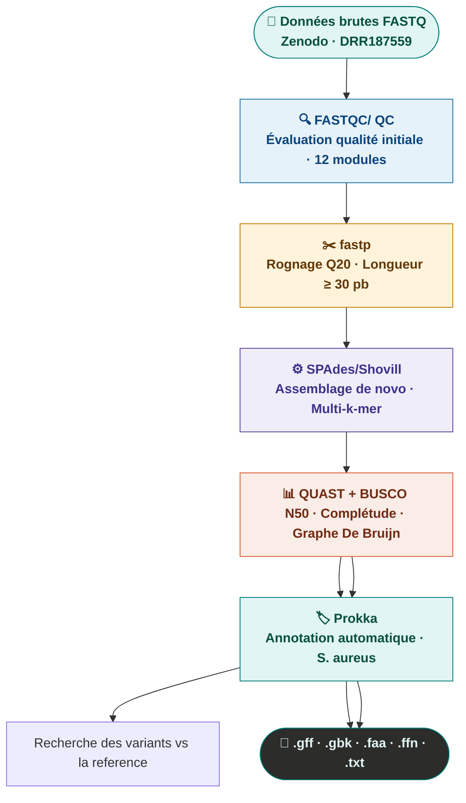

# Workshop Analyse Bioinformatique sous Galaxy 2026 — 

---

# 📚 Sommaire

* [Introduction](#-introduction)
* [Workflow bioinformatique](#-workflow-bioinformatique)
* [QC des données](#-qc-des-données)
* [Assemblage génomique](#-assemblage-génomique])
* [Recherche de variants](#-recherche-de-variants)
* [Analyse des AMRs](#-analyse-des-amrs)
* [Tutoriel sur sars-cov2](#-tutoriel-sur-sars-cov2)

---

# 🔬 Introduction

Bienvenue dans cet atelier d’analyse bioinformatique.

Ce support permet aux participants de :

* suivre les étapes d’un workflow bioinformatique ;
* Copier les liens d'acces aux données;
* cliquer pour afficher les réponses ;
* apprendre progressivement les concepts clés.

---

# 🧪 Workflow bioinformatique

```text
FASTQ brut
    ↓
Contrôle qualité (FastQC)
    ↓
Trimming / nettoyage
    ↓
Alignement / assemblage Recherche de variants / Annotation Recherche de Gene AMR
    ↓
Analyse biologique
```

---


# QC des données
> Basé sur le tutoriel GTN : [gxy.io/GTN:T00239](https://gxy.io/GTN:T00239

Lors du séquençage, les bases nucléotidiques d'un échantillon d'ADN ou d'ARN (bibliothèque) sont déterminées par le séquenceur. Pour chaque fragment de la bibliothèque, une séquence est générée, également appelée lecture , qui est simplement une succession de nucléotides.

Les technologies de séquençage modernes permettent de générer un grand nombre de séquences en une seule expérience. Cependant, aucune technologie n'est parfaite et chaque instrument produit des erreurs de nature et de quantité variables, comme l'identification incorrecte de nucléotides. Ces erreurs d'identification sont dues aux limitations techniques propres à chaque plateforme de séquençage.

Il est donc nécessaire de comprendre, d'identifier et d'éliminer les types d'erreurs susceptibles d'affecter l'interprétation des analyses ultérieures. Le contrôle qualité des séquences constitue ainsi une première étape essentielle de votre analyse. Détecter les erreurs au plus tôt permet de gagner du temps par la suite.

## Téléchargé un fichier de séquence brute
1. créez un nouveau historique
2. renommez le
3. importer les données NGS via Faster Download and Extract Reads in FASTQ en utilisant le ID SRR suivant 
````
SRR3111247
````
## Lancer l'outil FATSQC sur ces données
1. commbien des reads nous avons sur ces données?
2. Quelle la taille des reads?
3. Qu'est ce qu'il faut faire pour améliorer  ce jeux de données?
## Lancer fastp sur ce jeux de données en utlisant un cut-off de 50 pb en taille.
1. comparer le resumltats de filtrage avec le resultat de FASTQ.


# 🧬 Assemblage du Génome Bactérien MRSA
### Tutoriel Galaxy Training Network — Données Illumina MiSeq
 
> Basé sur le tutoriel GTN : [gxy.io/GTN:T00036](https://gxy.io/GTN:T00036)

---

---

## 🔬 Vue d'ensemble

Ce tutoriel guide l'**assemblage *de novo*** d'un génome bactérien
[MRSA](https://fr.wikipedia.org/wiki/Staphylococcus_aureus_résistant_à_la_méthicilline)
(*Methicillin-Resistant Staphylococcus aureus*) à partir de données de
séquençage **Illumina MiSeq Paired-End**, en utilisant la plateforme
**[Galaxy](https://usegalaxy.eu)**.

Les données proviennent de l'étude **Hikichi *et al.* 2019** portant sur
huit souches MRSA isolées de patients au Japon
([doi:10.1128/mra.01212-19](https://doi.org/10.1128/mra.01212-19)).

### Objectifs pédagogiques

| # | Objectif |
|---|----------|
| ✅ | Évaluer la qualité et la quantité des données de séquençage |
| ✅ | Améliorer la qualité des lectures brutes (trimming) |
| ✅ | Assembler un génome bactérien avec des lectures courtes |
| ✅ | Évaluer la qualité d'un assemblage (N50, contigs, BUSCO) |
| ✅ | Annoter automatiquement le génome assemblé |
| ✅ | Faire une analyse de variants (SNP/INDELS) par rapport à une souche de reference
| ✅ | Faire une analyse des gènes AMR - Virulence - Plasmides

### Questions biologiques abordées

- Comment vérifier la qualité des données MiSeq ?
- Comment réaliser l'assemblage *de novo* d'un génome bactérien ?
- Comment évaluer et interpréter la qualité d'un assemblage ?
- Combiende variations genetique entre le mutant et la réference?


## ⚡ Pipeline en un coup d'œil

```
Données brutes FASTQ (Zenodo)
        │
        ▼
┌───────────────┐
│   Falco / QC  │  ← Évaluation qualité initiale (12 modules)
└───────┬───────┘
        │
        ▼
┌───────────────┐
│    fastp      │  ← Rognage Q20 · Filtrage longueur ≥ 30 pb
└───────┬───────┘
        │
        ▼
┌───────────────┐
│    SPAdes/shovill     │  ← Assemblage de novo multi-k-mer
└───────┬───────┘
        │
        ▼
┌───────────────────────────────┐
│  QUAST + BUSCO    │  ← Évaluation de l'assemblage
└───────────────┬───────────────┘
                │
                ▼
        ┌───────────────┐
        │    Prokka     │  ← Annotation automatique
        └───────────────┘
                │
                ▼
             Snippy 
        Résultats finaux
        (GFF3, GenBank, FASTA protéines)
```

---

## 📥 Étape 1 — Préparation des données

### 1.1 Créer un historique Galaxy

1. Connectez-vous sur [usegalaxy.eu](https://usegalaxy.eu)
2. Cliquez sur l'icône **`+`** en haut du panneau Historique
3. Renommez l'historique : `MRSA_Assembly_MiSeq`

### 1.2 Importer les données depuis Zenodo

Les deux fichiers FASTQ paired-end de la souche DRR187559 :

```
https://zenodo.org/record/10669812/files/DRR187559_1.fastqsanger.bz2
https://zenodo.org/record/10669812/files/DRR187559_2.fastqsanger.bz2
```

**Dans Galaxy :**
1. Cliquez sur **Upload** (↑) dans la barre d'activités
2. Sélectionnez **Paste/Fetch Data**
3. Collez les deux URLs ci-dessus
4. Cliquez sur **Start** puis **Close**

### 1.3 Renommer les fichiers

Renommer chaque fichier en supprimant l'extension `.fastqsanger.bz2` :
- `DRR187559_1.fastqsanger.bz2` → **`DRR187559_1`**
- `DRR187559_2.fastqsanger.bz2` → **`DRR187559_2`**

### 1.4 Créer une collection Paired-End

1. Sélectionner les deux fichiers (coche ☑)
2. **n of N selected** → **Advanced Build List**
3. Choisir **List of Paired Datasets** → **Next**
4. Vérifier l'appariement automatique `_1` (forward) / `_2` (reverse)
5. Nommer la collection : **`Paired Reads`**
6. Ajouter le tag : **`#unfiltered`**

> **ℹ️ Format FASTQ** — Chaque lecture occupe 4 lignes :
> ```
> @SRR123456.1       ← identifiant (@)
> ATCGATCGATCG...    ← séquence nucléotidique
> +                  ← séparateur
> IIIIIIIIIIII...    ← scores de qualité Phred (ASCII)
> ```

---

## 🔍 Étape 2 — Contrôle qualité (QC)

### 2.1 Évaluation initiale avec Falco

**Outil :** `Falco` (v1.2.4+galaxy0)

| Paramètre | Valeur |
|-----------|--------|
| Raw read data | `Paired Reads` (collection) |

**Interpréter les résultats :**

| Code couleur | Score Phred | Interprétation |
|:---:|:---:|---|
| 🟢 Vert | Q > 28 | Bonne qualité |
| 🟡 Orange | Q 20–28 | Qualité moyenne |
| 🔴 Rouge | Q < 20 | Mauvaise qualité |

**Modules clés à vérifier :**
- **Per base sequence quality** — chute normale en fin de lecture (Illumina)
- **Adapter content** — présence d'adaptateurs à supprimer
- **Per sequence GC content** — courbe en cloche centrée (~33% pour *S. aureus*)

### 2.2 Rognage et filtrage avec fastp

**Outil :** `fastp` (v1.0.1+galaxy3)

| Section | Paramètre | Valeur |
|---------|-----------|--------|
| Input | Single-end or paired reads | `Paired Collection` |
| Filter Options → Length | Length required | **`30`** |
| Read Modification → Cutting | Cut by quality front (5') | **`Yes`** |
| Read Modification → Cutting | Cut by quality tail (3') | **`Yes`** |
| Read Modification → Cutting | Cutting window size | **`4`** |
| Read Modification → Cutting | Cutting mean quality | **`20`** |
| Output Options | Output JSON report | **`Yes`** |

Après l'exécution :
- Supprimer le tag `#unfiltered` des sorties fastp
- Ajouter le tag `#filtered`

**Résultats attendus :**

| Métrique | Avant | Après |
|----------|-------|-------|
| Longueur moyenne R1 | 190 bp | 189 bp |
| Longueur moyenne R2 | 221 bp | 219 bp |
| Bases Q30 (%) | < 90% | > 93% |
| Adaptateurs | Présents | Supprimés ✓ |
| Reads conservés | 100% | > 95% |

> **⚠️ Important** — Le %GC ne doit **pas** changer après filtrage.
> Un changement indiquerait une contamination.

---

## 🧩 Étape 3 — Assemblage avec SPAdes

### Principe de l'assemblage de novo

L'assemblage *de novo* reconstruit la séquence originale à partir des
fragments sans génome de référence. SPAdes utilise un **graphe de De Bruijn**
multi-k-mer : les k-mers (sous-séquences de longueur *k*) forment les nœuds ;
les chevauchements constituent les arêtes.

```
Lectures R1/R2 (paired-end)
        │
        ▼
    k-mers (21, 33, 55...)
        │
        ▼
   Graphe De Bruijn
        │
        ▼
Contigs → Scaffolds → Chromosome(s)
```

### Lancer SPAdes dans Galaxy

**Outil :** `SPAdes` (v4.0.0+galaxy2)

| Paramètre | Valeur |
|-----------|--------|
| Entrée | `Paired Reads` filtrés (#filtered) |
| Mode | Paired-end collection |
| Couverture | Calcul automatique |

### Fichiers de sortie

| Fichier | Description | Étape suivante |
|---------|-------------|----------------|
| `contigs.fasta` | Séquences continues assemblées | QUAST · Prokka |
| `scaffolds.fasta` | Contigs reliés par gaps (N) | Référence principale |
| `assembly_graph.gfa` | Graphe De Bruijn (format GFA) | Bandage |
| `spades.log` | Journal d'exécution | Diagnostic erreurs |

> **💡 Assemblage hybride** — Pour un génome bactérien complet (1 contig = 1 chromosome),
> combiner **Illumina** (précision) + **Nanopore** (longues lectures) avec **Unicycler**.

---

## 📊 Étape 4 — Évaluation de l'assemblage

### 4.1 Métriques avec QUAST

**Outil :** `Quast` (v5.2.0+galaxy1)

| Paramètre | Valeur |
|-----------|--------|
| Entrée | `contigs.fasta` (sortie SPAdes) |
| Génome de référence | Optionnel |

**Métriques clés et objectifs :**

| Métrique | Définition | Bon résultat |
|----------|-----------|--------------|
| **Nombre de contigs** | Total de contigs produits | Le moins possible |
| **N50** | L tel que 50% du génome est dans des contigs ≥ L | Le plus élevé |
| **L50** | Nombre minimal de contigs couvrant 50% | Le plus faible |
| **Taille totale** | Somme des longueurs | ≈ 2,8 Mb (*S. aureus*) |
| **Plus grand contig** | Longueur du plus long contig | Proche de 2,8 Mb |
| **% GC** | Contenu en GC | ~33% (*S. aureus*) |
| **Misassemblies** | Erreurs d'assemblage | 0 idéalement |

### 4.2 Complétude avec BUSCO

**Outil :** `BUSCO` — vérifie la présence de gènes orthologues conservés

**Objectif :** `> 95% Complete` pour un bon assemblage bactérien

### 4.3 Visualisation du graphe avec Bandage

**Outil :** `Bandage Image` (v0.8.1+galaxy4)

| Paramètre | Valeur |
|-----------|--------|
| Entrée | `assembly_graph.gfa` |
| Sortie | Image PNG du graphe |

**Interpréter le graphe :**
- ✅ **Nœuds linéaires sans embranchements** → bon assemblage
- ⚠️ **Bulles** → variants SNP ou erreurs de séquençage
- ⚠️ **Grandes boucles** → régions répétées dans le génome

---

## 🏷️ Étape 5 — Annotation avec Prokka

### Lancer Prokka dans Galaxy

**Outil :** `Prokka` (v1.14.6+galaxy1)

| Paramètre | Valeur |
|-----------|--------|
| Contigs | `contigs.fasta` (sortie SPAdes) |
| Taxon | Bacteria |
| Genus | *Staphylococcus* |
| Species | *aureus* |
| Locustag | MRSA |

### Fichiers de sortie Prokka

| Extension | Contenu | Usage |
|-----------|---------|-------|
| `.gff` | Annotations GFF3 | Visualisation IGV / JBrowse |
| `.gbk` | Format GenBank | Dépôt NCBI / EMBL |
| `.faa` | Séquences protéiques | Analyse fonctionnelle |
| `.ffn` | Séquences CDS nucléotidiques | Analyse ARN |
| `.txt` | Statistiques résumées | Contrôle rapide |
| `.tsv` | Tableau d'annotation | Analyse tabulaire |

---

## 📈 Résultats attendus

### Assemblage (SPAdes, données Illumina seules)

```
Taille totale attendue  : ~2,8 Mb
Nombre de contigs       : 10 – 50 contigs
N50                     : > 100 kb (bon résultat)
Plus grand contig       : ~500 kb – 1 Mb
% GC                    : ~33%
```

> **Note** : Un assemblage hybride Illumina + Nanopore produit typiquement
> **1 à 5 contigs** avec un N50 > 2 Mb (chromosome circulaire complet).

### Annotation (Prokka, *S. aureus* MRSA)

```
Gènes annotés totaux    : ~2 700 – 2 900
CDS avec fonction connue: ~2 200 – 2 500
Protéines hypothétiques : ~200 – 400
ARNt                    : ~60 – 80
ARNr                    : ~5 – 25
CRISPR                  : 0 – 2
```

---

## ❓ Questions fréquentes (FAQ)

<details>
<summary><strong>Qu'est-ce que le N50 et pourquoi est-il important ?</strong></summary>

Le N50 est la longueur *L* telle que 50% du génome assemblé total est contenu
dans des contigs de longueur ≥ *L*. Un N50 élevé indique des contigs longs et
un assemblage plus continu. C'est la métrique principale pour comparer la
qualité de différents assemblages.

</details>

<details>
<summary><strong>Pourquoi le QC est-il indispensable avant l'assemblage ?</strong></summary>

Les erreurs de séquençage introduisent de faux k-mers dans le graphe de
De Bruijn, fragmentant l'assemblage. Les adaptateurs non supprimés créent
de fausses jonctions. Un QC insuffisant conduit directement à :

- Plus de contigs (assemblage fragmenté)
- N50 plus faible
- Possibles misassemblies
- Contamination des variants identifiés

</details>

<details>
<summary><strong>Quelle est la différence entre un contig et un scaffold ?</strong></summary>

- **Contig** : séquence continue assemblée sans interruption
- **Scaffold** : ensemble de contigs reliés par des séquences de gaps (`N`),
  grâce aux informations de distance issues des reads paired-end

Un scaffold peut donc contenir plusieurs contigs séparés par des régions
d'incertitude (NNNNN).

</details>

<details>
<summary><strong>Pourquoi SPAdes plutôt qu'un autre assembleur ?</strong></summary>

SPAdes utilise plusieurs valeurs de k-mers simultanément (multi-k-mer) pour
améliorer la robustesse. Il est particulièrement adapté aux :

- Génomes bactériens (petits, peu répétitifs)
- Données Illumina paired-end
- Données avec couverture variable

Pour des lectures longues (Nanopore, PacBio), préférer **Flye** ou **Hifiasm**.
Pour un assemblage hybride, utiliser **Unicycler**.

</details>

<details>
<summary><strong>Mon assemblage a beaucoup de contigs courts — que faire ?</strong></summary>

1. Vérifier la couverture de séquençage (objectif : ≥ 50× pour *S. aureus*)
2. Relancer le QC et augmenter le seuil de qualité (Q25 au lieu de Q20)
3. Utiliser un assembleur hybride avec des lectures longues Nanopore
4. Filtrer les contigs courts (< 500 bp) avec `seqtk seq -L 500`

</details>

<details>
<summary><strong>Comment reproduire exactement cette analyse ?</strong></summary>

Toutes les étapes sont enregistrées automatiquement dans l'historique Galaxy.
Pour partager ou réutiliser :

1. **Exporter le workflow** : Workflow → Extract Workflow from History
2. **Partager via lien** : History → Share → Generate Link
3. **Publier sur WorkflowHub** : [workflowhub.eu](https://workflowhub.eu) → DOI citable

</details>

---

## 📚 Ressources et références

### Tutoriels et documentation

| Ressource | Lien |
|-----------|------|
| Tutoriel GTN complet | [training.galaxyproject.org](https://training.galaxyproject.org/training-material/topics/assembly/tutorials/mrsa-illumina/tutorial.html) |
| PURL permanent | [gxy.io/GTN:T00036](https://gxy.io/GTN:T00036) |
| Données Zenodo | [zenodo.org/record/10669812](https://zenodo.org/record/10669812) |
| Forum d'aide Galaxy | [help.galaxyproject.org](https://help.galaxyproject.org) |
| Galaxy Training Network | [training.galaxyproject.org](https://training.galaxyproject.org) |

### Documentation des outils

| Outil | Documentation |
|-------|---------------|
| Falco | [falco.readthedocs.io](https://falco.readthedocs.io) |
| fastp | [github.com/OpenGene/fastp](https://github.com/OpenGene/fastp) |
| SPAdes | [cab.spbu.ru/software/spades](https://cab.spbu.ru/software/spades) |
| Unicycler | [github.com/rrwick/Unicycler](https://github.com/rrwick/Unicycler) |
| QUAST | [quast.sourceforge.net](https://quast.sourceforge.net) |
| BUSCO | [busco.ezlab.org](https://busco.ezlab.org) |
| Bandage | [rrwick.github.io/Bandage](https://rrwick.github.io/Bandage) |
| Prokka | [github.com/tseemann/prokka](https://github.com/tseemann/prokka) |

### Article source des données

> Hikichi M, Nagao M, Murase K, Aikawa C, Nozawa T, Yoshida A,
> Watanabe T, Nakagawa I. **Complete Genome Sequences of Eight
> Methicillin-Resistant *Staphylococcus aureus* Strains Isolated from
> Patients in Japan.**
> *Microbiol Resour Announc.* 2019;8(46):e01212-19.
> [doi:10.1128/mra.01212-19](https://doi.org/10.1128/mra.01212-19)

### Outils bioinformatiques utilisés

> Chen S, Zhou Y, Chen Y, Gu J. **fastp: an ultra-fast all-in-one FASTQ
> preprocessor.** *Bioinformatics.* 2018;34(17):i884–i890.

> Prjibelski A, Antipov D, Meleshko D, Lapidus A, Korobeynikov A.
> **Using SPAdes de novo assembler.** *Curr Protoc Bioinformatics.*
> 2020;70(1):e102.

> Gurevich A, Saveliev V, Vyahhi N, Tesler G. **QUAST: quality assessment
> tool for genome assemblies.** *Bioinformatics.* 2013;29(8):1072–1075.

> Seemann T. **Prokka: rapid prokaryotic genome annotation.**
> *Bioinformatics.* 2014;30(14):2068–2069.

---

## ⚖️ Licence et attribution

Ce matériel est basé sur le tutoriel
[Genome Assembly of a bacterial genome (MRSA) sequenced using Illumina MiSeq Data](https://training.galaxyproject.org/training-material/topics/assembly/tutorials/mrsa-illumina/tutorial.html)
du **Galaxy Training Network**.

**Auteurs originaux du tutoriel GTN :**
Bazante Sanders · Bérénice Batut

**Licence du contenu tutoriel :**
[Creative Commons Attribution 4.0 International (CC-BY 4.0)](http://creativecommons.org/licenses/by/4.0/)

**Licence du framework GTN :**
[MIT](https://github.com/galaxyproject/training-material/blob/main/LICENSE.md)

---

<div align="center">

**🧬 Bon assemblage ! 🧬**

*Pour toute question : [help.galaxyproject.org](https://help.galaxyproject.org) · [Galaxy Training Network](https://training.galaxyproject.org)*

</div>
